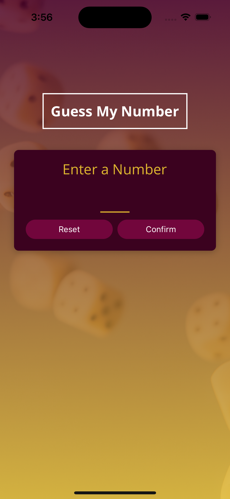

# Guess Number App

## Creation of the project

This project was created in VsCode using:  
`npm install -g expo-cli`
`npx create-expo-app GuessNumberGame`

The Apps purpose is to practice coding in React Native.  

### `Commands used:`

**Npx expo start** to run the app. 
**Npx expo start --tunnel** to run the app on real iphone if computer uses VPN. 

After running the app i run commands to open the app i simulators:
**Open IOS Simulator: I**  
**Open Android simulator: A**  

##

### `Home`

TThis is the Home-page, where the user can select a number.  
If the user is not satisfied with the number they can erase it using the Reset button.  
When the user has put in a number between 1 and 99 they can press Confirm to start playing.  

##

### `Projects`

The Projects-page features a list of projects i have done, I'm currently working on  
and some example projects to fill the empty space.

All the projects here are clickable and will open a new page showing a preview of the project.  
The preview contains screenshots, information and a clickable GitHub-icon  
that redirects to the corresponding project-repository.

##

### `Experience`

The Experience-page features a timeline showing my work and education experiences.  
It goes back to High-School and all the way to where I'm working today.

