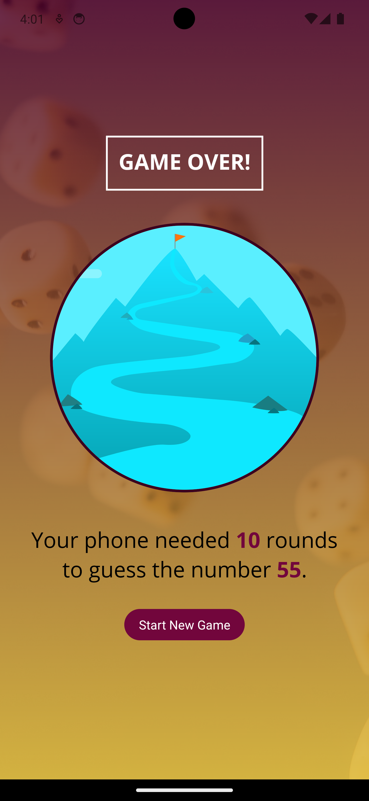

# Guess Number App

## Creation of the project

This project was created in VsCode using:  
`npm install -g expo-cli`
`npx create-expo-app GuessNumberGame`

The Apps purpose is to practice coding in React Native.  

### `Commands used:`

**Npx expo start** to run the app. 
**Npx expo start --tunnel** to run the app on real iphone if computer uses VPN. 

After running the app i run commands to open the app i simulators:
**Open IOS Simulator: I**  
**Open Android simulator: A**  

##

### `Home`

This is the Home-page, where the user can select a number.  
If the user is not satisfied with the number they can erase it using the Reset button.  
When the user has put in a number between 1 and 99 they can press Confirm to start playing.  

Above we see the homescreen on Android and Iphone.
##

### `Select Number`

Above we see a picked number on Android and Iphone.
##

### `Playing the Game`

Here the user is informing the app if the guess is above or belov the inputted number.

Above we see the game being played on Android and Iphone.
##

### `Select Number`

The game over screen summarises the number off guesses  
and allows the user to play again.  

Above we see the game over screen on Android and Iphone.
##